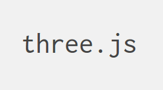

There are plenty of awesome websites and apps out there but they're, more often than not, only two dimensional. What we're going to do today is make something *three* dimensional!

All we need to make something this awesome is some HTML and Javascript so, really, anyone can make a 3D hack easily.

The main tool we'll be using for this is [Three.js](https://github.com/mrdoob/three.js/), which is an easy to use, lightweight, 3D library.



While we can into the detail of WwebGL and so forth, we should really just dive right in and make something!

To start, let's spin a [HTML/CSS/JS Repl](https://repl.it/languages/html)

Before we can use Three.js in our website we need to obtain it somehow. The two possible approaches we have are

* Download the Three.js library and attach to our website
* Make a link to the Three.js library so the user can download it him/herself

The simpler and more proficient approach is the second one where we insert a link to the Three.js library. Rather than download a file and attach to our site, we only need one line

```html
<script type="text/javascript" src="https://threejs.org/build/three.min.js"></script>
```

Let's put that at the bottom of our <head> element and now our index.html should look like this

```html
<!DOCTYPE html>
<html>
  <head>
    <meta charset="utf-8">
    <meta name="viewport" content="width=device-width">
    <title>repl.it</title>
    <link href="index.css" rel="stylesheet" type="text/css" />
    <script type="text/javascript" src="https://threejs.org/build/three.min.js"></script>
  </head>
  <body>
    <script src="index.js"></script>
  </body>
</html>
```

At this point, we have everything we need  in order to use Three.js in our program! Click on index.js in our file tree and you should see a blank file where we'll write all our Javascript for this project.

First, put in the following code

```javascript
function init() {
	console.log("Hello World!");
	update();
}

function update() {
	requestAnimationFrame(animate);
	console.log("Updating!");
}

window.onload = init;
```

The very last line tells the browser to run the `init` function when the page loads which prints "Hello World!" to the console then runs the update function.

'update' starts with a 'requestAnimationFrame` and this has the program run the update method on every frame. If you *`Inspect Element`* and check out the console in your browser. you should see that.

If you let it run for too long, it may lag your browser a bit since it's just printing the same thing over and over again at a very fast rate. Feel free to close the tab since there's nothing to see just yet.

As you could see, the `update()` method is being run rather quickly. This is beneficial since this means any movement we display should look smooth with little halting movement. Before we can add shapes or anything fancy, we need to get an environment so let's get that going!

At the top of our index.js let's declare some variables we'll use throughout the entire program

```javascript
var scene, camera, renderer;
```

The scene variable is where everything occurs in, the camera is the perspective from which we'll be viewing the whole ensemble, then the renderer is what will actually render everything on our page.

Let's initialize these variables in the `init()` function for organization and, starting with the scene, we're going to make a new scene like so

```javascript
scene = new THREE.Scene();
```

For everything relating to Three.js, we refer to it being from THREE so, in this case, we're checking out the `Scene` which then gives us `THREE.Scene`

That's all we need to do to create the scene, let's initialize our camera now so that we can actually view things

```javascript
camera = new THREE.PerspectiveCamera(
       90,
       400/300,
       0.1,
       1000
);
```

The type of camera I'm creating here is a _perspective camera_ and this simply means that what we'll be seeing should look more like it's being viewed from your human perspective than from a flat camera view. The first argument, "90", represents the [FOV](https://en.wikipedia.org/wiki/Field_of_view). The second argument, "400/300", represents the aspect ratio of the scene (meaning 400 and 300 are the width and heigh respectively of the rendered scene). Lastly, the 0.1 and 1000 represent the near and far [camera frustrums](https://en.wikipedia.org/wiki/Viewing_frustum).

```javascript
camera.position.x = 0;
camera.position.y = 0;
camera.position.z = 0;

camera.lookAt(new THREE.Vector3(1,1,1));
```

Here, I set the camera's position to be at the origin and direct the angle so that it's looking at the point (1,1,1). The last thing we need to initialize is the renderer, which has the simple job of rendering the scene so we can view it on the page.

```javascript
renderer = new THREE.WebGLRenderer();
renderer.setSize(400,300);
document.body.appendChild(renderer.domElement);

update();
```

These few lines create the renderer, set its size to 400 by 300, and add it into our HTML. The `update()` call at the end tells the browser to run `update()`, which makes itself run over and over but we need to render the scene so, in `update()`, put the following

```javascript
function update() {
	 requestAnimationFrame(animate);
	 
	 renderer.render(scene, camera);
}
```

Go ahead and run the program and you should have something like this

[Hey ho](https://repl.it/@yevbar/3D-Start)

While there may be a black box with nothing in it, the renderer is working and it's all pitch black because we didn't create anything to look at. Well, let's change that!

At the top of our program, let's declare a mesh variable for the mesh we'll be viewing in our scene.

```javascript
var scene, camera, renderer;
var mesh;
```

Then, in our `init()` method, we're going to initialize the mesh like so

```javascript
mesh = new THREE.Mesh(
     new THREE.BoxGeometry(1,1,1),
     new THREE.MeshLamberMaterial({
     	 color: 0xffffff
     })
);
```
     
What we're doing is creating a new Mesh object that's a 1x1x1 box and is colored 0xffffff, or white. While making it nice, we need to actually add it to our scene but that's as simple as it gets

```javascript
scene.add(mesh);
```

If we were to run it now, we wouldn't actually see anything because the camera is inside the box so let's go back to where we set the camera's position and change the values in addition to the coordinate the camera looks at.

```javascript
camera.position.x = 2;
camera.position.y = 2;
camera.position.z = 2;

camera.lookAt(new THREE.Vector3(0,0,0);
```

If you run it now, you still won't be able to see the box and it's not because of something wrong we did but the quick fix to this is to change the type of material our mesh is

```javascript
	new THREE.Mesh*Basic*Material({
```

_Now_, you can see your beautiful creation

[Hey ho again](https://repl.it/@yevbar/3D-First-Mesh)

While you can continue with BasicMaterial, I'd like to stick with LambertMaterial so I'm able to use lighting. To use lighting, let's turn the material type back to `MeshLambertMaterial` and add a lighting to the top with our other declarations

```javascript
var scene, camera, renderer;
var mesh, lighting;
```

Inside our `init()` method again, put the following code in

```javascript
lighting = new THREE.PointLight(0xffffff);

lighting.position.x = 5;
lighting.position.y = 5;
lighting.position.z = 5;

scene.add(lighting);
```

If you go and run it now, you should be able to see a beautiful cube

[Waat, it's a box!](https://repl.it/@yevbar/3D-First-Mesh-With-Lighting)

So far we haven't really done anything in our update function aside from render the scene over and over again so, let's add something in. With all the objects so far, we've been setting and modifying their positions so why don't we play around with their _rotation_

In `update()`, go ahead and put the following in

```javascript
requestAnimationFrame(update);

mesh.rotation.x += 0.01;
mesh.rotation.y += 0.02;

renderer.render(scene, camera);
```

The values I'm adding are very small because the unit used for angles is a [radian](http://mathworld.wolfram.com/Radian.html) and this is enough to make something pretty.

[woah](https://repl.it/@yevbar/3D-First-Mesh-Woah)

Now that we have an object we can reference to, let's add in some keybinds and movements. At the top, let's go and declare a "keyboard" object

```javascript
var mesh, lighting;

var keyboard = {};
```

The reason we're creating an object is that it's very easy to assign values to certain keys (pun intended) and read them intuitively so that if `keyboard["A"]` or equivalent is  true, then the "A" key is being pressed. To make that actually occur, let's put in some eventListeners above the `window.onload` line

```javascript
function keyDown(event) {
	keyboard[event.keyCode] = true;
}

function keyUp(event) {
	keyboard[event.keyCode] = false;
}

window.addEventListener('keydown', keyDown);
window.addEventListener('keyup', keyUp);

window.onload = init;
```

So that we have a constant that we can refer to for movement let's also create that at the top of the program

```javascript
var keyboard = {};
const speed = 0.01;
```

Since we want to always be checking and changing if a key is pressed, the movement controls will go into the `update()` function and let's put in some if statements to watch for what we're looking for. For this, I'll be using WASD for my movement.

```javascript
function animate() {
	 requestAnimationFrame(animate);

	 if (keyboard[87]) {
	    // W key
	    camera.position.z -= speed;
	 }

	 if (keyboard[83]) {
	    // S key
	    camera.position.z += speed;
	 }

	 if (keyboard[65]) {
	    // A key
	    camera.position.x -= speed;
	 }

	 if (keyboard[68]) {
	    // D key
	    camera.position.x += speed;
	 }

	 mesh.rotation.x += 0.01;
	 mesh.rotation.z += 0.02;

	 renderer.render(scene, camera);
}
```

If you try moving now, you'll find that the movement of the box is a bit funky and that's because we set our camera position in a place that doesn't align well with the movements we created so let's change that

```javascript
camera.position.x = 0;
camera.position.y = 2;
camera.position.z = 4;
```

Now when we move around with WASD, it moves nicely!

To make the visuals a bit cleaner, let's also change the point at which the is looking

```javascript
camera.lookAt(new THREE.Vector3(0,2,0));
```

[yo it moves!](https://repl.it/@yevbar/3D-With-Movement)

While it's nice to be able to move around, it would be nice if we could move around and also rotate like we're an actual avatar walking around. To make that happen, we're going to add in another keybind to rorate the camera about an axis and then, in the conditionals that move the camera around, we're going to multiply the speed by a factor of a trig function.

```javascript
if (keyboard[37]) {
   // Left arrow key
   camera.rotation.y += Math.PI * 0.01;
}

if (keyboard[39]) {
   // Right arrow key
   camera.rotation.y -= Math.PI * 0.01;
}
```

The above allows us to rotate the camera but moving around will make it feel like we're awkwardly ice skating so, with the help of trigonometry, this gets fixed!

```javascript
if (keyboard[87]) {
   // W key
   camera.position.x -= Math.sin(camera.rotation.y) * speed;
   camera.position.z -= Math.cos(camera.rotation.y) * speed;
}

if (keyboard[83]) {
   // S key
   camera.position.x += Math.sin(camera.rotation.y) * speed;
   camera.position.z += Math.cos(camera.rotation.y) * speed;
}

if (keyboard[65]) {
   // A key
   camera.position.x += Math.sin(camera.rotation.y - Math.PI/2) * speed;
   camera.position.z += Math.cos(camera.rotation.y - Math.PI/2) * speed;
}

if (keyboard[68]) {
   // D key
   camera.position.x -= Math.sin(camera.rotation.y - Math.PI/2) * speed;
   camera.position.z -= Math.cos(camera.rotation.y - Math.PI/2) * speed;
}
```

Now we can move with WASD and also rotate with the left/right arrow keys

[woah, that's pretty cool](https://repl.it/@yevbar/3D-With-Rotation)

Since we're working on making the environment more enjoyable and playable, let's add in a floor that a game can happen on. We can have the game happen without a floor but having a floor is nice.

At the top, let's declare the floor variable

```javascript
var scene, camera, renderer;
var mesh, lighting, floor;
```

Inside our `init()` function, we use the following code to create and add the floor

```javascript
floor = new THREE.Mesh(
      new THREE.PlaneGeometry(10, 10, 10, 10),
      new THREE.MeshLamberMaterial({
      	  color: 0x009999,
	  wireframe: true
      })
);

floor.rotation.x -= Math.PI/2;

scene.add(floor);
```

As before, we use the LambertMaterial so that the light can shine on it. If you look inside the material arguments, you'll see that I included a "wireframe: true" and this gives you a cool wired design

[insert screenshot of wireframe floor]

What is nice about including the floor is that moving around can feel better as there's now a ground to visually reference movement to. The arguments in the PlaneGeometry represent width, height, and the othe r values are what determine the number of lines shown. Go ahead and see what happens when you use smaller or bigger numbers.

Now that we have a platform to introduce more things on top of, let's introduce more things! Since we've been handling with rectangles and rectangular shapes so far, let's bring in a sphere.

However, adding a sphere is only a matter of intializing a new mesh with the geometry required for a sphere

```javascript
sphereMesh = new THREE.Mesh(
	   new THREE.SphereGeometry(1, 16, 16),
	   new THREE.MeshLambertMaterial({
	       color: 0xcc0000
	   })
);
```

So let's think about what we can do with these meshes and shapes. For one, we can bring in movements. Right now all we have is a rotating cube and we can do a lot better than that.

For this, we'll introduce an array called `meshes`

```javascript
var scene, camera, renderer;
var mesh, lighting, floor;

var meshes = [];

var keyboard = {};
```

What we're looking to implement is a way to create and launch spheres like fireballs (or kamahameha if you're a DBZ fan) from wherever our current position is. Let's start by listening for the "1" key in `update()`

```javascript
if (keyboard[49]) {
   // 1 key

}
```

When the button gets pressed, we want to first create a sphere so let's do that using SphereGeometry

```javascript
if (keyboard[49]) {
   // 1 key
   var sphereMesh = new THREE.Mesh(
       new THREE.SphereGeometry(1, 16, 16),
       new THREE.MeshLambertMaterial({
       	   color: 0xcc0000
       })
   );

   sphereMesh.position.x = camera.position.x;
   sphereMesh.position.z = camera.position.z;

   scene.add(sphereMesh);
```

Now we need the amounts that our coordinates change by with every frame. If we want this to move directly forward from us, then it will be exactly like the "W" movement if we pressed it right at that moment so let's copy some of that.

```javascript
var changeX = -Math.sin(camera.rotation.y) * speed;
var changeZ = -Math.cos(camera.rotation.y) * speed;
```

Let's 

```javascript
meshes.push({
	move: function() {
	      sphereMesh.position.x += changeX;
	      sphereMesh.position.z += changeZ;
        }
});
```

So now our entire if statement for the "1" key looks like this

```javascript
if (keyboard[49]) {
   // 1 key
   var meshSphere = new THREE.Mesh(
       new THREE.SphereGeometry(1, 16, 16),
       new THREE.MeshLambertMaterial({
       	   color: 0xcc0000
       })
   );

   scene.add(sphereMesh);

   var changeX = -Math.sin(camera.rotation.y) * speed;
   var changeZ = -Math.cos(camera.rotation.y) * speed;

   meshes.push({
	move: function() {
	      sphereMesh.position.x += changeX;
	      sphereMesh.position.z += changeZ;
	}
   });
}
```

While creating and adding the sphereMesh is nice, we need to trigger that `move` function so, near the end of the `update` function, let's iterate through each of the meshes inside `meshes` and run each of their move functions

```javascript
meshes.map(m => m.move());
```

And now we can channel our inner Goku

[wowza inner goku](https://repl.it/@yevbar/3D-With-Spheres)

While this is certainly cool, the spheres overlap a bit because this is triggered by a keydown event rather than a keypress event so let's change that. First, we'll add a keypress event

```javascript
function keyPress(event) {

}

window.addEventListener('keypress', keyPress);
```

Then, inside the keypress event, we'll simply use the code we had for shooting creating the sphere.

```javascript
function keyPress(event) {
	 if (event.keyCode == 49) {
	    var sphereMesh = new THREE.Mesh(
	    	new THREE.SphereGeometry(1, 16, 16),
		new THREE.MeshLambertMaterial({
		    color: 0xcc0000
		})
	    );

	    sphereMesh.position.x = camera.position.x;
	    sphereMesh.position.z = camera.position.z;

	    scene.add(sphereMesh);

	    var changeX = -Math.sin(camera.rotation.y) * speed;
	    var changeZ = -Math.cos(camera.rotation.y) * speed;

	    meshes.push({
		move: function() {
		      sphereMesh.position.x += changeX;
		      sphereMesh.position.z += changeZ;
		}
	    });
	 }
}
```

Now there's one more thing we should fix with the spheres and that's what to do when they're far away. For us, we don't care or need spheres that are outside the floor so we can put in a conditional that checks for the coordinates of the sphere. Rather than juggle between multiple scopes, let's just put the conditional inside the move function.

```javascript
move: function() {
      sphereMesh.position.x += changeX;
      sphereMesh.position.z += changeZ;
      if (Math.abs(sphereMesh.position.x) > 10 || Math.abs(sphereMesh.position.z) > 10) {
      	 scene.remove(sphereMesh);
	 delete meshes[meshes.indexOf(this)];
      }
}
```

For collision what we'll do is, first, add the mesh to the appended meshes object

```javascript
meshes.push({
	m: sphereMesh,
	move: function() {
	      sphereMesh.position.x += changeX;
	      sphereMesh.position.z += changeZ;

	      if (Math.abs(sphereMesh.position.x) > 10 || Math.abs(sphereMesh.position.z) > 10) {
	      	 scene.remove(sphereMesh);
		 delete meshes[meshes.indexOf(this)];
	      }
       }
});
```

Then, inside the move function, the following

```javascript
meshes.push({
	m: sphereMesh,
	move: function() {
	      sphereMesh.position.x += changeX;
	      sphereMesh.position.z += changeZ;

	      if (Math.abs(sphereMesh.position.x) > 10 || Math.abs(sphereMesh.position.z) > 10) {
	      	 scene.remove(sphereMesh);
		 delete meshes[meshes.indexOf(this)];
	      }

	      meshes.map(function(mesh) {
					if (Math.abs(sphereMesh.position.x - mesh["m"].position.x
					if (Math.abs(sphereMesh.position.x - camera.position.x) < 1 || Math.abs(sphereMesh.position.z - camera.position.z) < 1) {
					   scene.remove(sphereMesh);
					   delete meshes[meshes.indexOf(this)];
					}
	      })
	}
});
```

The issue at hand is that this code will prevent us from launching spheres frequently so we'll only have collision occur when it's a sphere and a cube. The way we check for that is by taking a given mesh and checking `mesh.geometry.vertices.length`. With cubes, this value is 8

```javascript
meshes.map(function(mesh) {
			  if (mesh["m"].geometry.vertices.length === 8 && (if Math.abs(sphereMesh.position.x - mesh["m"].position.x) < 1 || Math.abs(sphereMesh.position.z - mesh["m"].position.z) < 1)) {
			     scene.remove(sphereMesh);
			     delete meshes[meshes.indexOf(this)];
			  }
}
```

The conditional is a bit long and mess, granted, but it does the trick and we can now add in randomly generating cubes. For this, we'll be adding a cube very 2 seconds and the way we'll know that is by getting the current unix time in seconds and checking if it's even or not

```javascript
Math.floor(Date.now() / 1000) % 2 === 0
```

So, in our `update()` function, let's slap that in

```